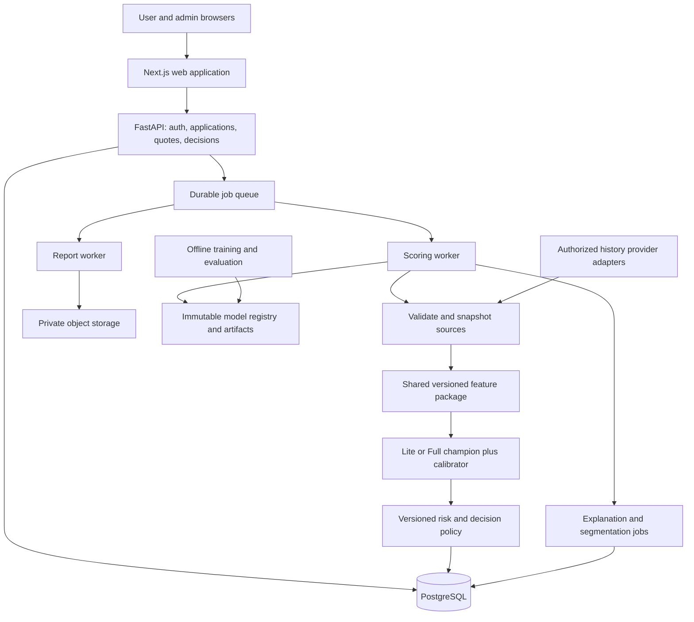
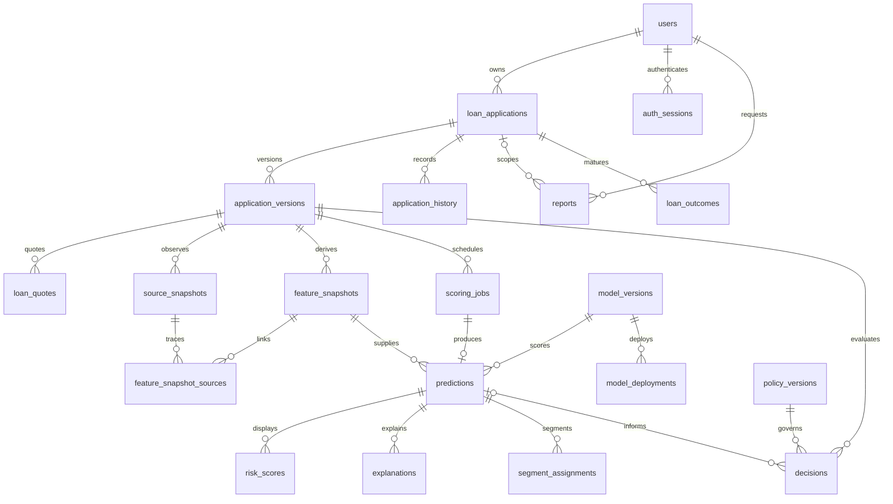

# CreditIQ — ML and System Design

Date: 2 October 2026. Status: proposed v1 design, implementation not started.

Current progress note: the line above records the original design checkpoint. ML remediation and Lite research training now exist; Milestone 1 adds the services/api foundation only. See PROJECT_PROGRESS.md and BACKEND_ARCHITECTURE.md for current implementation boundaries. The remaining Phase B layout is still a proposal.

Milestone 2 update (3 October 2026): the B2 storage schema is implemented in services/api/app/db/models/schema.py with revision 20261003_0001. BACKEND_ARCHITECTURE.md documents additive provenance fields, immutable-record triggers and research-only constraints. LIVE policy remains intentionally disallowed; APIs/authentication/model loading/frontend remain proposed, not implemented.

This document completes Phase A conceptually before specifying Phase B. It preserves and repairs the existing Phase 1 ML package. It contains contracts and design decisions, not implementation code.

The contracts below are fixed proposals for v1. Model performance, population suitability, the original dataset's monetary/payment definitions, and production decision thresholds remain release gates because the actual CSVs and trained artifacts have not been validated. A design can specify how those gates are resolved; it cannot supply empirical evidence that does not exist.

# Phase A — Fix the ML Design First

## A1. Scope and governing definitions

1. V1 supports individual applicants for cash installment loans only. Revolving-credit applications are excluded from the training cohort and unsupported by the application flow.
2. TARGET=1 is the positive class. Until the original outcome documentation is verified, outputs mean estimated probability of the dataset's adverse outcome. No 12-month, lifetime, or regulatory-default horizon is asserted.
3. All feature inputs describe information available at decision time T. A record must have both an event time and an available-at time no later than T. Historical dataset adapters must document where availability is assumed rather than observed.
4. Money is expressed in one declared, validated model currency/unit. Income is annual; loan payments are monthly. No silent currency conversion or assumption that anonymized Home Credit amounts are rupees is permitted. The training adapter must verify AMT_ANNUITY frequency before release.
5. IDs, names, email, gender, loan purpose, raw dates of birth, and source identifiers are not predictive features. Age is included provisionally, subject to documented feature-use and cohort validation before live deployment.
6. Unknown, confirmed no history, and source unavailable are different states. Only a complete source response can establish no history.
7. Lite and Full are separate calibrated models. Their probabilities are never averaged and their risk percentiles have separate reference distributions.
8. Gender is omitted from the v1 application form and scoring contracts. Restricted fairness research, if undertaken, uses a separately governed dataset.

## A2. Final Lite contract — lite-v1

### A2.1 Exact prediction-request fields

The internal scoring request contains the following fields. Applicant identity comes from the authenticated application, not from a user-supplied customer ID. Fields marked required-nullable must be explicitly supplied; null is an acknowledged unknown, not an omitted requirement.

| Field | Type / requirement | Definition and validation |
|---|---|---|
| application_id | UUID, required metadata | Server-owned application identity; never a feature. |
| application_version | Positive integer, required metadata | Immutable submitted input revision. |
| as_of | UTC timestamp, required metadata | Server-fixed observation cutoff T. |
| product_code | Enum CASH_INSTALLMENT_V1, required metadata | Unsupported products receive no score. |
| currency | Three-letter currency code, required metadata | Must match the released model's supported monetary domain. |
| quote_id | UUID, required metadata | Valid, unexpired, server-issued quote bound to application version. |
| age_years | Number, required | Age at T; adult applicants only, with approved product age limits. Dataset adapter uses -DAYS_BIRTH/365.25. |
| employment_type | Enum, required | WORKING, COMMERCIAL_ASSOCIATE, STATE_SERVANT, PENSIONER, UNEMPLOYED, STUDENT, BUSINESSMAN, MATERNITY_LEAVE, OTHER. These preserve source category distinctions; human-readable labels must explain their verified meaning. |
| years_employed | Nonnegative number or null, required-nullable | Tenure in current employment. Null for unknown/not applicable; zero only for known zero tenure. Must not exceed age. |
| annual_income | Positive decimal, required | Applicant annual income under the documented income definition, in model currency. |
| requested_amount | Positive decimal, required | Principal requested, within product limits and equal to quote principal. |
| quoted_monthly_payment | Positive decimal, required, server-derived | Contractual monthly payment from the quote. Not editable by the applicant. |
| education_level | Enum, required | LOWER_SECONDARY, SECONDARY, INCOMPLETE_HIGHER, HIGHER, ACADEMIC_DEGREE, OTHER. |
| household_size | Integer >=1, required | People in the household, including applicant. |
| dependent_children | Integer >=0, required | Dependent children, not total financial dependents. Must be <= household_size-1. |
| occupation | Enum or null, optional | Versioned occupation vocabulary below; null means unreported. |
| housing_status | Enum or null, optional | OWN_OR_APARTMENT, WITH_PARENTS, RENTED, MUNICIPAL, OFFICE, COOPERATIVE, OTHER. |

Occupation vocabulary: LABORER, CORE_STAFF, ACCOUNTANT, MANAGER, DRIVER, SALES, CLEANING, COOKING, PRIVATE_SERVICE, MEDICAL, SECURITY, HIGH_TECH, WAITING_BAR, LOW_SKILL_LABOR, REALTY_AGENT, SECRETARY, IT, HR, OTHER. A versioned mapping enumerates the matching Home Credit category spellings. Unknown source categories map to OTHER; missing maps to MISSING. Mapping coverage is checked before training. Do not infer that OTHER has adequate training support: unsupported combinations trigger a data-support review flag.

Employment mapping: Working -> WORKING; Commercial associate -> COMMERCIAL_ASSOCIATE; State servant -> STATE_SERVANT; Pensioner -> PENSIONER; Unemployed -> UNEMPLOYED; Student -> STUDENT; Businessman -> BUSINESSMAN; Maternity leave -> MATERNITY_LEAVE; any remaining documented value -> OTHER. Do not equate Commercial associate with self-employment without evidence. Source-category definitions must be verified before writing the form help text. If an applicant cannot choose a supported category confidently, use OTHER with a support/verification flag rather than silently guessing. No automatic decision is allowed for an unsupported category population.

### A2.2 Exact Lite predictive features: 17

The schema lists semantic model inputs before fitted one-hot expansion. Encoded columns are persisted in the release manifest and may differ by training vocabulary; no additional raw feature is implicitly admitted.

| # | Feature | Definition | Training source |
|---|---|---|---|
| 1 | age_years | Age at observation | application_train.DAYS_BIRTH |
| 2 | years_employed | Employment tenure; sentinel 365243 -> null | DAYS_EMPLOYED |
| 3 | annual_income | Annual income | AMT_INCOME_TOTAL |
| 4 | requested_amount | Requested/current principal | AMT_CREDIT |
| 5 | quoted_monthly_payment | Monthly contractual payment | AMT_ANNUITY, after unit verification |
| 6 | household_size | Household member count | CNT_FAM_MEMBERS |
| 7 | dependent_children | Dependent child count | CNT_CHILDREN |
| 8 | employment_type | Canonical category | NAME_INCOME_TYPE |
| 9 | education_level | Canonical category | NAME_EDUCATION_TYPE |
| 10 | occupation | Canonical category or MISSING | OCCUPATION_TYPE |
| 11 | housing_status | Canonical category or MISSING | NAME_HOUSING_TYPE |
| 12 | employment_tenure_missing | 1 when years_employed is null, else 0 | Derived after sentinel handling |
| 13 | proposed_payment_income_ratio | quoted_monthly_payment / (annual_income/12) | Derived |
| 14 | principal_income_ratio | requested_amount / annual_income | Derived |
| 15 | income_per_household_member | annual_income / household_size | Derived |
| 16 | employed_age_ratio | years_employed / age_years; null if tenure unknown | Derived |
| 17 | payment_principal_ratio | quoted_monthly_payment / requested_amount | Derived; not loan duration |

For training, mandatory-field invalidity excludes the row with a recorded exclusion reason and cohort statistics; inference returns a validation error. Optional nulls follow the trained imputation/category rules. Required-nullable tenure is permitted, but the observed missingness pattern must be within the model's supported population. No application is scored from an empty or mostly absent payload.

Numeric ratios must be finite. Mandatory positive denominators are validated before feature derivation. Imputation values and any justified clipping limits are fitted only inside the appropriate training partition. Binary flags and counts are not blanket-winsorized. Unknown categories are explicitly represented and monitored. Sensitive raw data is not logged.

### A2.3 Mapping the user form

| User form field | Final handling |
|---|---|
| Name | Profile/identity only; no predictive feature. |
| Age | age_years; preferably derive consistently from verified birth date, which is kept outside the feature vector. |
| Gender | Remove from v1 form and model inputs. |
| Employment type | Canonical employment_type. Form labels must exactly match verified source semantics. |
| Years employed | years_employed; explicit unknown/not applicable option. |
| Income | Annual amount, currency and income definition shown beside the field. |
| Existing loans | Policy/supporting information only. Add existing_monthly_debt_payment for affordability. Never map a self-reported count to historical ACTIVE_CREDIT_COUNT. |
| Credit card usage | Optional supporting information only; collect balance and limit if needed. Never substitute it for historical utilization mean. |
| Requested amount | requested_amount; used to request a server quote. |
| Loan purpose | Application metadata/product eligibility only; absent from the ML contract because no matching validated training feature is defined. |
| Education | education_level. |
| Dependents | Replace ambiguous field with dependent_children and household_size. Total financial dependents may be captured separately for policy. |
| New: occupation, housing status | Optional canonical categories. |
| New: term and quote | Requested term is a quote input; rate and monthly payment are server-owned. Term/rate are policy metadata, not additional ML features in v1. |

Existing monthly debt payment and verification status are required for automatic affordability assessment, but not for producing a provisional Lite PD. Missing debt obligations mean no automatic approval.

### A2.4 Lite output contract

prediction_id; application_version; model_version; feature_schema_version; calibration_version; target_definition_version; model_variant=LITE; calibrated_pd; risk_score; risk_band; reference_percentile; data_quality_flags; verification_status; scored_at; explanation_status. A separate decision record provides decision_status and policy_version. No output promises credit approval merely because a prediction succeeded.

## A3. Final Full contract — full-v1

Full consumes the same 17 Lite semantic features plus exactly 43 history features below: **60 predictive features total**. Source availability and provenance are routing/quality metadata, not hidden extra model inputs.

### A3.1 Source requirements

| Source | Key/grain | Required validation |
|---|---|---|
| application_train/application_test | One application per SK_ID_CURR | Disjoint train/test identities; no conflicting duplicates; cash-installment product; mandatory Lite fields valid. TARGET exists only for labeled training/evaluation. |
| bureau | One account per SK_ID_BUREAU | Unique account ID and owner; observation/availability cutoff. |
| bureau_balance | One bureau account/month | Join to bureau owner; unique month snapshot or deterministic source-version reconciliation. |
| previous_application | One application per SK_ID_PREV | Unique ID and owner; status known as of T; decision date <=T. |
| installments_payments | Payment events linked to contractual schedule items | Reconciled installment/schedule identity, amounts and payment-event identity; see A3.3. |
| POS_CASH_balance | One loan/month | Unique SK_ID_PREV/month after revision reconciliation; stable owner. |
| credit_card_balance | One card account/month | Unique SK_ID_PREV/month, stable owner, valid balances/limits. |

A source response must be COMPLETE, CONFIRMED_EMPTY, UNAVAILABLE or INVALID, with fetched_at, source_as_of, schema version and content hash. Full requires COMPLETE or CONFIRMED_EMPTY for every source family. Provider completeness must include pagination and coverage windows. A matching application exists independently of whether history is empty.

For a complete source, count=0 is allowed when there are no records. Monetary sums are 0 only for confirmed no relevant accounts; all-null amounts within existing accounts stay null and carry a quality flag. Undefined ratios and delay averages stay null. Partial coverage is not treated as confirmed empty. Invalid/inconsistent records block Full or route to review; they are never silently discarded to obtain an approval.

Online source freshness is a versioned policy requirement per provider/product. The concrete SLA must be established with the real provider before live Full activation; no invented freshness guarantee is attached to the historical Kaggle tables.

### A3.2 Exact Full history features

All account counts count unique source account IDs. All financial sums below are within one source, avoiding unverified cross-source account deduplication. History covers records available by T within the provider's declared coverage; coverage shifts require drift evaluation.

| # | Feature | Definition |
|---|---|---|
| 18 | bureau_account_count | Unique bureau accounts. |
| 19 | bureau_active_count | Accounts whose as-of CREDIT_ACTIVE is Active. |
| 20 | bureau_closed_count | Accounts whose as-of CREDIT_ACTIVE is Closed. |
| 21 | bureau_overdue_count | Accounts with CREDIT_DAY_OVERDUE >0. |
| 22 | bureau_total_credit | Sum AMT_CREDIT_SUM across bureau accounts. |
| 23 | bureau_total_debt | Sum AMT_CREDIT_SUM_DEBT. |
| 24 | bureau_total_overdue | Sum AMT_CREDIT_SUM_OVERDUE. |
| 25 | bureau_max_dpd | Maximum nonnegative CREDIT_DAY_OVERDUE. |
| 26 | bureau_oldest_account_age_days | Maximum of -DAYS_CREDIT for valid past credit origination dates. |
| 27 | bureau_newest_account_age_days | Minimum of -DAYS_CREDIT for valid past credit origination dates. |
| 28 | bureau_observed_status_months | Count of account-months with known status 0,1,2,3,4,5. C and X excluded from this denominator. |
| 29 | bureau_delinquent_months | Account-months with status 1–5. |
| 30 | bureau_severe_months | Account-months with status 3–5. Label stays bucket-based until bucket-day meanings are verified. |
| 31 | bureau_late_month_ratio | bureau_delinquent_months / bureau_observed_status_months; null for zero denominator. |
| 32 | previous_application_count | Unique previous applications decided by T; includes all documented statuses. |
| 33 | previous_approved_count | Unique previous applications with Approved status. Not represented as disbursed loans. |
| 34 | previous_refused_count | Unique previous applications with Refused status. |
| 35 | previous_refusal_rate | Refused count / previous_application_count; null when none. |
| 36 | previous_applications_365d | Applications with T-365 days <= decision time <=T. |
| 37 | days_since_previous_application | T minus most recent valid decision date, in days. |
| 38 | installment_due_count | Number of reconciled positive-amount installments due on or before T. |
| 39 | installment_fully_paid_count | Due installments whose cumulative recognized payments satisfy the due amount by T. |
| 40 | installment_late_count | Due installments paid in full after due date OR still incomplete with due date <T. Count each installment once. |
| 41 | installment_unpaid_overdue_count | Incomplete due installments with due date <T. |
| 42 | installment_late_rate | installment_late_count / installment_due_count. |
| 43 | installment_mean_signed_delay | Mean(completion date - due date) over fully paid due installments; early payments negative. |
| 44 | installment_mean_overdue_days | Mean positive overdue duration across all due installments: max(completion-due,0) if complete, max(T-due,0) otherwise. |
| 45 | installment_max_overdue_days | Maximum of the same per-installment overdue duration. |
| 46 | installment_mean_paid_ratio | Mean of min(recognized cumulative payment / amount due,1) across due installments. |
| 47 | pos_loan_count | Unique POS loan IDs with eligible snapshots. |
| 48 | pos_active_loan_count | Loans whose latest eligible snapshot status is Active. |
| 49 | pos_observed_months | Count of valid loan-month snapshots. |
| 50 | pos_max_dpd | Maximum nonnegative SK_DPD. |
| 51 | pos_mean_dpd | Mean SK_DPD across valid loan-month observations. |
| 52 | pos_late_month_ratio | Loan-months with SK_DPD>0 / loan-months with known SK_DPD. |
| 53 | card_account_count | Unique card account IDs with eligible snapshots. |
| 54 | card_current_balance | Sum AMT_BALANCE from latest snapshot per active card account. |
| 55 | card_current_limit | Sum AMT_CREDIT_LIMIT_ACTUAL from those same accounts. |
| 56 | card_current_utilization | Sum(max(balance,0)) / sum(limit), across latest active account snapshots; null if positive balance has invalid/missing limit or total limit is zero. |
| 57 | card_historical_mean_utilization | Mean max(balance,0)/limit over account-months with known balance and positive limit. |
| 58 | card_historical_max_utilization | Maximum of those valid historical ratios. Values >1 are retained; no arbitrary cap at 2. |
| 59 | card_max_dpd | Maximum nonnegative SK_DPD over eligible card-months. |
| 60 | card_late_month_ratio | Card-months with SK_DPD>0 / card-months with known SK_DPD. |

Card current monetary totals use the same account set; missing balances/limits do not create partial totals presented as complete. Historical ratios remain account-month weighted, deliberately giving longer observed histories more weight. This weighting is documented and evaluated for coverage bias. Latest-snapshot ties must resolve by source revision timestamp or be rejected when conflicting.

Excluded from Full v1: EXT_SOURCE_1/2/3 and composites; property-document flags; enquiry-window sums; unverified total-active-loans across sources; the old PREV_LOAN_COUNT; unidentified external score proxies. EXT_SOURCE exclusion may reduce benchmark AUC materially. This is a deliberate availability/interpretability tradeoff, to be measured rather than concealed. Additional validated features require a new contract version and retraining.

### A3.3 Installment reconciliation — resolving the payment-grain defect

1. Preserve customer, loan, installment number, schedule version, due date, due amount, payment amount, payment date, and available-at provenance.
2. A schedule item is identified by loan, installment number and effective schedule version. Multiple versions are not automatically summed or resolved by choosing the largest version number: determine which contractual schedule was in force at T from source semantics. Without that mapping, flag ambiguity and block Full scoring for the affected applicant.
3. Within an effective schedule item, validate consistent due date/amount. Deduplicate payment events using provider event IDs. The Home Credit adapter lacks guaranteed payment-event identity and must establish/document its duplicate rule; indistinguishable legitimate payments cannot safely be dropped merely because amounts/dates match.
4. Consider only payments known by T, including valid prepayments. Sum recognized payments in chronological order. Completion is the first date cumulative payment reaches due amount, using the validated currency's minor-unit tolerance. Handle reversals only through documented event semantics; otherwise flag them.
5. Only installments due by T contribute to due-performance counts. Future scheduled obligations may inform affordability separately, not observed delinquency.
6. Incomplete installments contribute overdue duration T-due when overdue. Signed completion delay is undefined for them, so they are excluded only from the signed-completion average, not from late counts or overdue averages.
7. Example: 100 due on day 10, paid 50 on day 8 and 50 on day 12 -> one fully paid installment, one late installment, signed delay +2, overdue days 2, paid ratio 1. Two late partial transactions never create two late installments.

Home Credit's payment table may not include a complete schedule of never-paid installments. The adapter must assess coverage against available loan/schedule information. If completeness cannot be established, rename the affected features to recorded-installment measures and issue a new feature contract before training; do not claim contractual due-count completeness. Until resolved, full-v1 is not releasable. Lite can still be evaluated independently.

## A4. Risk scoring and decision framework

### A4.1 Scores and bands

- calibrated_pd = the released calibrator applied to the positive-class model output, finite and in [0,1].
- risk_score = 100 * calibrated_pd, displayed to two decimals. Higher means more risk. Use unrounded PD for all comparisons.
- credit_health_index = 100 * (1-calibrated_pd), rounded for display and explicitly branded as a CreditIQ model index. Omit the old bureau-like 300–850 score from v1. This index is a display complement, not an independently validated health measure.
- Optional reference_percentile = 100 * F_reference(calibrated_pd), using the fixed empirical reference distribution for that variant/release. Equal probabilities get the same percentile. Never recompute reference cutoffs per live batch.

The following is the **exact sandbox policy**, chosen to make development behavior deterministic. It is not an empirically validated production policy.

| PD interval | Display risk band | Risk-score interval | Risk-only sandbox recommendation |
|---|---|---|---|
| 0 <= p < 0.05 | Low | [0,5) | APPROVAL_CANDIDATE |
| 0.05 <= p < 0.15 | Medium | [5,15) | MANUAL_REVIEW |
| 0.15 <= p <= 1 | High | [15,100] | REJECTION_CANDIDATE |

Thus approval cutoff tA=0.05; review begins inclusively at 0.05; rejection cutoff tR=0.15. Review ends exclusively at 0.15. There is no separate contradictory review cutoff. Threshold invariant: 0<tA<tR<1. A score displayed as 5.00 may still be Low if the underlying p is just below 0.05; the UI should explain rounding rather than change the stored band.

For production, tA and tR are **unset until validated** and stored separately per model variant/product/policy version. They may differ from display-band boundaries. Live automatic approvals/rejections are disabled while production policy is unset. The final architecture supports final numeric thresholds but this document does not claim they can be estimated without data.

### A4.2 Decision precedence and safety against contradictory rules

1. Invalid request -> validation error, no PD, no credit decision.
2. Unsupported product/population, unavailable champion, unresolved data quality, missing required verification, or out-of-support input -> MANUAL_REVIEW or operational PENDING_DATA; never fabricate a probability.
3. A valid Lite score gives a provisional recommendation. V1 does not automatically approve or reject an applicant solely from Lite.
4. Full score plus verified income, obligations, eligible product, and supported inputs can be evaluated by a released production policy. Below tA is only an approval candidate; affordability and product checks must also pass. At/above tR is a rejection candidate only under that released policy. Otherwise review.
5. In sandbox/shadow mode, candidates remain recommendations. Final application decisions are made through recorded review; they do not represent a real credit offer.
6. Policy hard-rule failures are kept separate from model risk, with explicit reasons. Failed verification and service errors are not credit rejections.
7. Reviewer overrides require reason, actor, time and evidence. Original predictions/recommendations remain immutable.

### A4.3 How production thresholds are selected

On independent policy-validation data, examine each candidate pair tA<tR for observed loss/default outcomes, approval volume, review volume, cohort disparities, and uncertainty. Enforce business-supplied exposure/loss/margin assumptions and capacity constraints; do not optimize F1 as the lending objective. Test thresholds on the untouched final cohort only after freezing them. If estimates are too uncertain or cohort constraints fail, keep that region in review.

Absolute PD bands communicate model risk; reference percentiles support administrative triage. Neither a percentile nor a KMeans label directly determines approval. Production cutoffs remain stable within a policy version; population drift triggers review rather than silently changing boundaries.

Affordability uses total monthly obligations, including the proposed quote payment, divided by verified monthly income. The allowable ratio, product amount/term caps, and disposable-income floor are business policy parameters, unset for live use until approved. A recommended amount is calculated only from verified obligations and a valid quote: allowed payment budget minus existing obligations, converted to principal using the quoted rate/term and capped by product limits. Missing inputs return amount_unavailable. PD alone never produces a recommended loan amount.

## A5. Training, selection and critical-issue closure

### A5.1 Dataset partition and experiment sequence

Reserve customer-disjoint partitions once: 60% development, 15% calibration, 10% policy validation, 15% final test, stratified when using the historical dataset. Save identities and hashes. When reliable calendar dates and matured outcomes exist, prefer chronological partitions and preserve customer boundaries. Relative day offsets do not alone support a valid out-of-time split.

Within the 60% development cohort, use inner CV for hyperparameter tuning and outer validation folds to compare model families and calibration methods. Feature selection, clipping, imputation, encoding and class-weight estimation are fold-local. Calibration assessment inside this development process must also use disjoint fitting/evaluation data. Select the family, preprocessing rules and calibration method using development evidence only.

Fit the chosen base estimator on development; fit the selected calibrator on the separate 15% calibration cohort; choose decision thresholds on the 10% policy-validation cohort. Freeze the entire bundle and policy, then evaluate once on final test. Do not refit on calibration/policy/test after this evaluation without issuing and evaluating a new release. Compare sigmoid and isotonic empirically; their data separation requirements are described by [scikit-learn](https://scikit-learn.org/stable/modules/calibration.html).

Lite is trained on eligible application rows, never on invented bureau-history proxies. Full is trained only where full-v1 source/semantic validity is established. Use shared partition assignments for paired comparison on the Full-eligible subset, and separately report Lite results on its broader eligible population. Report exclusion rates and calibration for confirmed-no-history cohorts.

Keep Logistic Regression as baseline and compare the existing tree/forest/boosting candidates offline. Select one champion for each contract based on independent discrimination, calibration, stability and serving cost, not a predeclared algorithm winner. Record AP rather than ambiguously labeled PR_AUC; report confidence intervals, constant-prevalence baselines and cohort calibration.

### A5.2 C1–C5 closure matrix

| Critical issue | Final conceptual correction | Evidence required before release |
|---|---|---|
| C1 Form/Lite mismatch | Exact 17-feature Lite schema, explicit missing rules, server quote, no historical proxies | Every field traceable to form/server and training source; mandatory-field rejection cases; supported category coverage |
| C2 Train/serve mismatch | One canonical feature implementation and fitted preprocessing bundle used by both adapters | Golden input produces identical ordered features and PD offline/online, including category/null handling |
| C3 Payment-row aggregation | Effective contractual schedule plus cumulative recognized payments; one observation per due installment | Split payments, early/late payment, never-paid, schedule change, duplicate and cutoff fixtures; source completeness verified |
| C4 Validation reuse | Development selection, separate calibrator fit, separate policy selection, sealed final test | Persisted disjoint IDs and experiment lineage; no threshold/model changes after final-test inspection |
| C5 Unjustified/overlapping thresholds | Separate versioned policy; tA<tR invariant; affordability and verification gates; shadow defaults | Independent threshold evaluation, explicit costs/capacity, boundary tests and policy approval before activation |

**Phase A design is conceptually complete.** Its release gates are explicit: verified dataset semantics, population/currency compatibility, installment completeness, real training/evaluation and validated production policy. They are not resolved empirical facts. Phase B below specifies how to enforce these contracts without weakening them.

# Phase B — System Design

## B1. Final ML and application architecture

Use Next.js/TypeScript/Tailwind/shadcn/ui/Recharts for the web application; FastAPI owns domain validation, scoring orchestration, authorization and database writes. PostgreSQL stores application/audit state. Use SQLAlchemy and Alembic for the Python-owned persistence layer. This intentionally replaces the initial Prisma proposal: Prisma targets the TypeScript/Node runtime, so placing it alongside Python ownership would introduce a second database abstraction/migration owner. See [Prisma's runtime documentation](https://docs.prisma.io/docs/orm/reference/system-requirements).

Use the latest patched supported Next.js release compatible with the chosen UI dependencies at implementation time; if Next.js 15 remains a project constraint, verify its support/patch status before pinning. This document does not prescribe an unverified patch version.



This is a modular service plus worker deployment, not a fleet of model microservices. Redis-backed durable queue jobs use PostgreSQL outbox records for reliable dispatch; PostgreSQL remains the source of truth. Reports/artifacts/source extracts reside in private object storage with access checks, retention and hashes. Training runs offline and is never triggered by public scoring requests.

## B2. PostgreSQL schema

All primary IDs are UUIDs; timestamps are timestamptz stored in UTC. Monetary values use numeric(20,2) for the initial two-decimal-currency product; rate fields use numeric with documented precision. A different currency minor-unit model requires a schema/contract change. PD uses double precision with finite [0,1] validation. JSONB payloads have application-level versioned validation; essential relationships and bounds also have database constraints.

| Table | Key fields and relationships |
|---|---|
| users | id PK, normalized_email UNIQUE, password_hash, role USER/ADMIN, account_status, created_at, updated_at. Separate scoped admin permissions distinguish reviewer, analyst and model operator. |
| user_profiles | user_id PK/FK users, full_name, restricted birth_date if collected, contact/profile fields, updated_at. No model decision is reproduced from mutable profile data. |
| auth_sessions | id PK, user_id FK, hashed_refresh_token UNIQUE, token_family_id, expires_at, revoked_at, created_at. |
| loan_applications | id PK, user_id FK, current_version integer, product_code, currency, requested_amount, workflow_status, current_decision_id nullable FK, created_at, submitted_at, updated_at. |
| application_versions | id PK, application_id FK, version integer, input_schema_version, immutable_input_json, input_hash, as_of, created_by FK users, created_at; UNIQUE(application_id,version). Contains exact submitted facts including their verification state. |
| loan_quotes | id PK, application_version_id FK, product_version, principal, term_months, annual_rate, monthly_payment, fees_json, currency, expires_at, created_at. Immutable issued quote. |
| data_consents | id PK, application_id FK, user_id FK, purpose, source_scope, consent_version, granted_at, revoked_at nullable. |
| source_snapshots | id PK, application_version_id FK, source_type, state, source_as_of, fetched_at, schema_version, coverage_json, object_key, content_hash, consent_id FK nullable. Raw financial history stays out of ordinary application JSON. |
| feature_snapshots | id PK, application_version_id FK, variant, feature_schema_version, feature_values_json, ordered_feature_hash, quality_flags_json, as_of, created_at. Immutable and protected. |
| feature_snapshot_sources | feature_snapshot_id FK, source_snapshot_id FK; composite PK. Explicit provenance for each included source. |
| model_versions | id PK, release_name UNIQUE, variant, feature_schema_version, target_definition_version, training_manifest_key, artifact_key, sha256, calibration_version, runtime_lock_hash, metrics_json, lifecycle_status, created_at. |
| model_deployments | id PK, product_code, variant, model_version_id FK, activated_at, retired_at nullable. Partial unique active deployment per product/variant; authorized activation only. |
| scoring_jobs | id PK, application_version_id FK, variant_requested AUTO/LITE/FULL, status, model_version_id nullable FK, idempotency_key, error_code, attempts, created_at, completed_at. Scoped UNIQUE(application_version_id,idempotency_key); body hash detects conflicting reuse. |
| predictions | id PK, scoring_job_id FK UNIQUE, application_version_id FK, feature_snapshot_id FK, model_version_id FK, raw_positive_output, calibrated_pd, quality_flags_json, verification_status, scored_at. Immutable; no client-provided PD accepted. |
| risk_scores | id PK, prediction_id FK, score_policy_version, risk_score, risk_band, reference_percentile nullable, reference_cohort_version nullable, credit_health_index, created_at; UNIQUE(prediction_id,score_policy_version). Derived values immutable and reproducible. |
| policy_versions | id PK, version UNIQUE, product_code, variant, mode SANDBOX/SHADOW/LIVE, approve_below nullable, reject_at nullable, band_thresholds_json, affordability_rules_json, validation_report_key, approved_by FK nullable, effective_from. LIVE requires nonnull ordered thresholds and release evidence. |
| decisions | id PK, application_version_id FK, prediction_id nullable FK, policy_version_id FK, status, reason_codes_json, affordability_snapshot_json, actor_id nullable FK users, supersedes_id nullable FK decisions, created_at. Separate recommendation versus final-decision kind; immutable. |
| explanations | id PK, prediction_id FK, explainer_version, explained_output, reference_version, base_value, contributions_json, remainder_value, additivity_error, status, created_at; UNIQUE(prediction_id,explainer_version). |
| segment_assignments | id PK, prediction_id FK, segmenter_version, segment_id, label, distance, status, created_at. Independent from risk band and decision. |
| reports | id PK, requested_by FK users, application_id nullable FK, report_type, format PDF/XLSX, filter_snapshot_json, status, object_key nullable, content_hash nullable, expires_at, created_at, completed_at. |
| application_history | id PK, application_id FK, application_version_id nullable FK, actor_id nullable FK, event_type, old_status, new_status, decision_id nullable FK, request_id, redacted_event_json, created_at. Append-only business history. |
| loan_outcomes | id PK, application_id FK, outcome_definition_version, observation_end, outcome_matured, default_observed nullable, exposure nullable, loss_amount nullable, source_snapshot_id nullable FK, created_at. No inferred nondefault from immature observations. |
| audit_events | id PK, actor_id nullable FK, action, entity_type, entity_id, request_id, redacted_metadata_json, created_at. Captures access, exports, model/policy changes and admin actions. |
| outbox_events | id PK, aggregate_id, event_type, payload_reference, created_at, dispatched_at nullable, attempt_count. Transactional job publication. |

Constraints and indexes: FK ownership consistency between application versions, quotes, features, predictions and decisions; positive money/term bounds; ordered thresholds; valid finite PD; unique immutable versions; indexes on applications(user_id,created_at), applications(workflow_status,submitted_at), predictions(application_version_id,scored_at), history(application_id,created_at), reports(requested_by,created_at) and jobs(status,created_at). Do not cascade-delete scored decision history when a profile changes or closes; use an explicit retention/anonymization process.

Prediction and current decision are not one-to-one: multiple immutable model runs and reviews may exist for the same version. The current decision pointer must reference a decision for the same application/current version. A transaction with optimistic version checks writes decision, pointer update and history together. Policy reevaluation creates a new decision; it never overwrites PD. Risk-score recomputation under a changed display policy creates a new versioned record.

### ER diagram — principal relationships



## B3. API specification

All application endpoints are under /api/v1. JSON fields follow the contracts above; OpenAPI is the future source of generated TypeScript types. User endpoints enforce ownership server-side. Admin endpoints require appropriate permission as well as role. Pagination uses cursor and limit; timestamps use UTC ISO 8601. Financial values are decimal strings. Errors expose code, safe message, field errors and request_id, not internal exception dumps.

| Method and path | Access | Request / result |
|---|---|---|
| POST /auth/register | Public, rate-limited | Email/password/profile minimum -> user; cannot select admin role. |
| POST /auth/login | Public, rate-limited | Credentials -> authenticated session; secure HttpOnly cookies. |
| POST /auth/refresh | Session | Rotates refresh token; detects reuse. |
| POST /auth/logout | Session | Revokes current session. |
| POST /auth/password-reset/request | Public, rate-limited | Uniform acknowledgement, no account enumeration. |
| POST /auth/password-reset/confirm | Reset token | New password; revoke existing sessions. |
| GET /me | User | Own account/profile summary. |
| PATCH /me/profile | User | Allowed profile updates; does not alter prior application versions. |
| GET /me/dashboard | User | Latest relevant decision, PD/index, history counters and eligibility/amount availability. |
| POST /applications | User | Create draft with product and initial inputs -> application ID/version. |
| GET /applications | User | Own applications, cursor/filter. |
| GET /applications/{id} | Owner/admin | Application plus current version and processing/decision state. |
| PATCH /applications/{id} | Owner | Draft edit with expected_version; submitted records immutable. |
| POST /applications/{id}/revisions | Owner | Create new draft revision after changes; invalidates old quote for new revision. |
| POST /applications/{id}/quotes | Owner | Amount, term and version -> server-generated immutable quote. |
| POST /applications/{id}/consents | Owner | Explicit source/purpose/version consent -> consent record. |
| DELETE /applications/{id}/consents/{consentId} | Owner | Revoke future access; records revocation, not silent history deletion. |
| POST /applications/{id}/submit | Owner | Quote ID, version, required inputs, acknowledgements; idempotency key -> 202 job ID. |
| POST /applications/{id}/withdraw | Owner | Allowed state transition; history recorded. |
| GET /scoring-jobs/{id} | Owner/admin | QUEUED/RUNNING/SUCCEEDED/FAILED/PENDING_DATA plus safe failure code/result IDs. |
| GET /applications/{id}/predictions | Owner/admin | Versioned prediction summaries, Lite/Full provenance. |
| GET /predictions/{id} | Owner/admin | PD, score/band, version references and quality flags. |
| GET /predictions/{id}/explanation | Owner/admin | Available explanation or pending/failed status, units and reference metadata. |
| GET /applications/{id}/decision | Owner/admin | Current recommendation/final decision with policy and reasons. |
| GET /applications/{id}/history | Owner/admin | User-safe immutable timeline. |
| GET /admin/overview | Admin analyst | Real application/user counts, pending reviews and decision totals. |
| GET /admin/applications | Admin reviewer | Filtered, paginated cross-user queue. |
| GET /admin/applications/{id}/review-context | Admin reviewer | Authorized evidence, feature quality and prediction lineage. |
| POST /admin/applications/{id}/score | Admin reviewer | Variant request/reason/expected version -> 202 job; server enforces routing. |
| POST /admin/applications/{id}/decisions | Admin reviewer | Decision, reason, expected version/current decision ID -> immutable decision and history. |
| GET /admin/analytics | Admin analyst | Metric selector: approval_rate, rejection_rate, risk_distribution, income_distribution, occupation_outcome, education_outcome; date/product/model filters. |
| GET /admin/segments | Admin analyst | Segment counts/profiles, segmenter version and availability. |
| GET /admin/models | Model operator | Registry metadata and evaluation evidence. |
| GET /admin/models/{id} | Model operator | Detailed release manifest and validation status. |
| POST /admin/model-deployments | Model operator | Activate already validated release; atomic routing change and audit event. |
| GET /admin/policies | Policy operator | Versioned display/decision policies. |
| POST /admin/policies | Policy operator | Create immutable candidate policy; does not activate it. |
| POST /admin/policies/{id}/activate | Policy approver | Activate only when validation evidence and threshold invariants pass. |
| GET /admin/monitoring | Model operator | Missingness, drift, calibration on matured outcomes, service/error metrics. |
| POST /reports | User/admin | Type, PDF/XLSX, permitted scope/filter -> 202 report ID. |
| GET /reports | User/admin | Own/authorized report jobs. |
| GET /reports/{id} | Requester/authorized admin | Status and provenance. |
| GET /reports/{id}/download | Requester/authorized admin | Authorized short-lived download; expired/unready report is not downloadable. |
| GET /health/live | Operations | Process liveness only; no sensitive diagnostics. |
| GET /health/ready | Restricted operations | Database/queue/model bundle readiness. |

401 unauthenticated; 403 insufficient permission; 404 for inaccessible owned resources; 409 revision/idempotency/state conflict; 422 invalid contract; 429 rate limit; 503 temporary dependency failure. POST submit/score/report/decision requests use scoped idempotency keys. The same key with different content returns 409. Worker retries produce one prediction per job. No public endpoint accepts arbitrary model paths, joblib uploads, raw PDs or decision thresholds.

Cookie sessions use short-lived JWT access tokens, rotating refresh tokens, secure HttpOnly/SameSite settings and CSRF protection for mutations. The backend validates signature, issuer, audience, expiration and current account permissions. Frontend route guards are convenience only; authorization always happens in FastAPI. Service-to-service/provider integration uses separate credentials and restricted interfaces rather than user JWTs.

Analytics denominators are explicit: approval/rejection rates use finalized decisions in the selected cohort, excluding drafts/pending. Outcome/default charts use matured outcomes, never predicted labels as observed defaults. Offline Home Credit EDA is separately labeled research data and cannot seed live user/application counts. Small cohort data is suppressed according to reporting policy.

## B4. Proposed folder structure

This is a planned layout, not files to generate now. Existing ml/creditiq_ml modules are refactored in place as appropriate; the stable model-wrapper import path is retained for any supported historical artifacts.

```text
creditiq/
  docs/
    audit/
    design/
    model-cards/
    data-dictionaries/
    runbooks/
  apps/
    web/
      src/
        app/
          (auth)/login/
          (auth)/register/
          (auth)/reset-password/
          (user)/dashboard/
          (user)/apply/
          (user)/applications/[id]/
          (user)/applications/[id]/result/
          (user)/applications/[id]/explanation/
          (user)/profile/
          admin/overview/
          admin/applications/[id]/
          admin/analytics/
          admin/segments/
          admin/explainability/
          admin/reports/
          admin/models/
          admin/policies/
        components/ui/
        components/charts/
        features/applications/
        features/predictions/
        features/reviews/
        lib/api/
        lib/auth/
        lib/formatting/
        generated/api-types/
      tests/
  services/
    api/
      app/
        routers/
        schemas/
        domain/
        services/
        repositories/
        db/models/
        auth/
        policies/
        integrations/history/
        observability/
      migrations/
      tests/
    worker/
      jobs/scoring/
      jobs/explanations/
      jobs/segmentation/
      jobs/reports/
      jobs/outcomes/
      tests/
  ml/
    creditiq_ml/
      contracts/
      adapters/home_credit/
      adapters/application/
      features/
      preprocessing/
      training/
      calibration/
      evaluation/
      serving/
      explainability/
      segmentation/
      model_wrapper.py
      cli.py
    tests/unit/
    tests/contract/
    tests/fixtures/
    tests/integration/
    data/raw/               [ignored; controlled local research data]
    data/processed/         [ignored; fingerprinted cache]
    artifacts/             [ignored; local release copies]
    reports/               [generated research results]
  contracts/
    feature-schemas/
    category-mappings/
    target-definitions/
    policy-schemas/
  infra/
    containers/
    deployment/
    monitoring/
  tests/end-to-end/
  .github/workflows/
```

The contracts directory is the semantic authority. Both training and serving import the same Python feature package; TypeScript only validates/formats request data, it does not reimplement feature arithmetic. Generated API types derive from FastAPI's OpenAPI contract.

## B5. Model serving architecture

### Immutable release bundle

Each variant release contains: model; fitted preprocessors; calibrator; positive-class identity; exact 17/60-feature schema; category mappings; feature implementation/package version; target definition; supported population/product/currency; missing-value rules; optional per-feature clipping bounds; runtime lock; training/split/data hashes; evaluation and calibration report; development-derived explanation background; explanation units; reference percentile distribution; artifact checksums. Policy versions reference releases but remain independently versioned.

Workers load trusted approved bundles at startup, verify hashes/schema/runtime compatibility, execute a golden prediction and mark readiness. Artifacts are loaded only from a controlled registry, never user uploads. Warm workers reuse models across jobs; no per-request training/loading. Worker count is bounded by measured model memory, with estimator threads capped to avoid oversubscription. Jobs have timeouts and retry budgets.

### Prediction transaction sequence

1. Validate ownership, application revision, quote and consent. Save immutable submission, scoring job and outbox event in one transaction.
2. Dispatch and lock the job idempotently. Pin model/policy versions so retries do not switch releases.
3. Obtain eligible source snapshots and evaluate routing. Build canonical features with the shared package; enforce mandatory data and feature order.
4. Persist feature/source provenance and score. Validate finite output and positive-class interpretation; calibrate; calculate unrounded-policy band/score/percentile.
5. Write immutable prediction and risk record. Evaluate policy only against the matching application revision; prevent a late old-version job from replacing a newer decision.
6. Queue explanation/segmentation if supported. Explanation failure is recorded independently; when reasons are mandatory for final action, decision remains review-pending until valid reasons exist.
7. Return completed status through polling. Retries may update job status but never produce duplicate prediction or decision events.

Separate operational state (queued/running/failed) from credit status (review/approved/rejected). A timeout cannot turn into a rejection.

### Explainability

Explain the uncalibrated champion output in v1, display calibrated PD separately, and state units precisely. Tree/forest probability outputs and boosting/logistic margin outputs must not share a hardcoded log-odds label. Record target class, base value, contribution vector, remainder and additivity tolerance. Feature grouping uses fitted transformer metadata, not string-prefix guesses. Positive means increases the explained adverse-outcome score; it does not prove causation. Only meaningful, accurate factors become user-facing reasons; no fabricated generic reasons.

### Segmentation

Segmentation is optional analytics, never a decision input. Discovery uses development data; all transforms and clipping bounds are saved. k is chosen from stability, size and silhouette/interpretability evidence rather than forced to three. Use descriptive names until independently observed outcomes justify risk wording. Full-history segmentation is unavailable for Lite-only applicants; do not fill absent history to manufacture a segment. Segment labels, risk bands and approval states are separate fields.

### Monitoring and rollback

Monitor input/schema rejection, source availability/freshness, variant routing share, category/missingness drift, score distribution, band/decision volume, latency and job failures. On matured outcomes, monitor calibration, AP/AUC, band outcome rates and relevant cohorts. Keep outcome maturity explicit. Compare Lite versus Full on the same eligible cohort, rather than comparing unrelated populations. Revert active deployments to the previous validated version atomically; old records retain original model/policy identities. Drift starts investigation and review routing, not automatic retraining or threshold movement.

## B6. How Lite and Full interact with the application

| Situation | Model/application behavior |
|---|---|
| New draft | No PD shown; collect Lite fields and quote inputs. |
| Valid submission without complete verified history | Lite score and provisional result; final state MANUAL_REVIEW/PENDING_DATA as appropriate. |
| Every Full source complete or confirmed empty, contract valid | Full is the primary score for that revision; optional Lite shadow score for paired monitoring. |
| Provider unavailable before Full scoring | Lite may be displayed as provisional with history-unavailable flag; no automatic decision. |
| Provider returns contradictory or invalid data | Review required. Do not obtain a favorable Lite decision by ignoring adverse/invalid Full evidence. |
| Full model execution fails | Retry or review; prior valid result may remain visible with its timestamp. No silent model substitution for final decision. |
| Full result arrives after provisional Lite | Create a new prediction; make Full authoritative only for matching current revision and authorized policy. Keep Lite in history. |
| Lite and Full disagree | Display authoritative Full plus review rationale where policy requires; never average scores or choose the more favorable result. |
| Applicant changes amount/income/term | New application revision and quote, new features and score. Historical results remain immutable. |
| No production threshold release | Sandbox/shadow recommendations only; automatic real-world decisions disabled. |

User dashboard shows current verified/provisional status, calibrated PD, model risk band, CreditIQ index, decision status, and amount recommendation only when supported. Result/explanation screens identify whether history was used and separate adverse model factors from policy/verification reasons. Admins see routing provenance, data-quality flags, versions, review evidence and immutable overrides.

Neither model grants loans. Models estimate the defined outcome; policy and authorized reviewers make recorded decisions. This separation, together with explicit input contracts and independent evaluation, is the core requirement before implementation starts.
